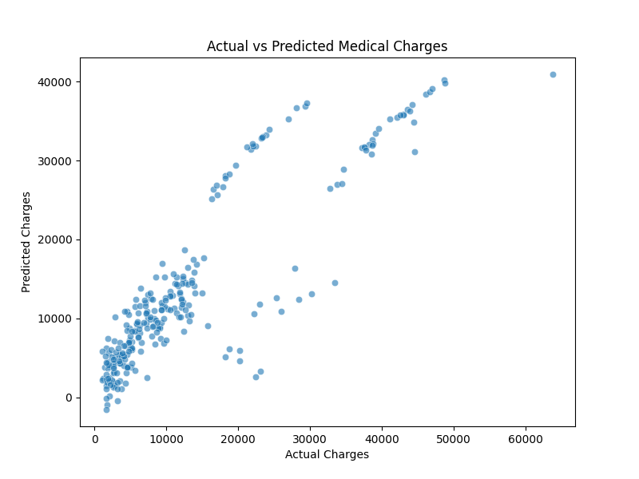

# 🏥 Medical Insurance Cost Prediction

##  Overview
This project predicts **medical insurance charges** based on factors like **age, BMI, smoking status, and region**. The goal is to build a regression model that estimates insurance costs given patient data.

##  Dataset
- **Source:** [Kaggle - Medical Cost Dataset](https://www.kaggle.com/datasets/mirichoi0218/insurance)
- **Features:**
  - `age`: Age of the person
  - `bmi`: Body Mass Index
  - `children`: Number of dependents
  - `smoker`: Smoker status (yes/no)
  - `region`: Residential area
  - `charges`: Insurance cost (Target variable)

##  Steps
1. **Exploratory Data Analysis (EDA)**: Visualized feature relationships.
2. **Preprocessing**: Encoded categorical variables & scaled numerical features.
3. **Model Training**: Used **Linear Regression**.
4. **Evaluation**: Measured performance using **Mean Absolute Error (MAE) and Mean Squared Error (MSE)**.

##  Installation & Usage
Clone the repository:
```bash
git clone https://github.com/M26I/medical-insurance-prediction
cd medical-insurance-prediction
```
Install dependencies:
```bash
pip install -r requirements.txt
```
Run the model training script:
```bash
python src/train.py
```

## Results
The model achieved:
- **Mean Absolute Error (MAE):** `4181.19`
- **Mean Squared Error (MSE):** `33596915.85`

Example plot:



## Contributing
Feel free to fork this repository, make improvements, and submit pull requests.

##  Acknowledgments
Thanks to Kaggle for providing the dataset.

---
**Author:** [MIW](https://github.com/M26I)

